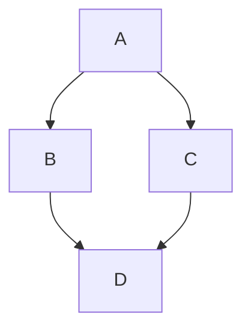

# mdbookwrite —— 编写单个 mdbook 文件

指导 AI 在本项目（个人静态主页，Rust + Dioxus）里编写 / 修改 `mdbooks/` 下 mdbook 工程的 Markdown 章节。

## 何时使用

- 新增或编辑某本 mdbook 书里的一篇章节 `.md`（`mdbooks/<书名>/src/**/*.md`）
- 处理文件内以 `#AI` 开头的**编写任务**（见「`#AI` 任务约定」）
- 新增一本书：建 `book.toml` / `src/SUMMARY.md`，并在 `mdbooks/manifest.toml` 登记
- 把新章节登记进 `src/SUMMARY.md`
- 在章节里插入 / 修改 Mermaid 图表（见「图表（Mermaid）」）

## 工程结构

每本书是一个目录（`mdbooks/<书名>/`）：

```
mdbooks/
├── manifest.toml              # 书籍清单：[[book]] 的 name / path / id / intro
└── <书名>/
    ├── .gitignore             # 忽略构建产物目录 `book`；用图的书另忽略 mermaid.min.js / mermaid-init.js
    ├── book.toml              # 书名 / 作者 / 语言 / 输出配置（可含 mermaid 预处理器）
    ├── mermaid.min.js         # 可选：mdbook-mermaid 生成物（用图的书才有，已 gitignore、不入库）
    ├── mermaid-init.js        # 可选：mdbook-mermaid 生成物（用图的书才有，已 gitignore、不入库）
    ├── book/                  # mdbook build 产物（已被 gitignore）
    └── src/
        ├── SUMMARY.md         # 目录：登记每一章
        ├── 关于此书.md
        └── <分组>/<章节>.md   # 章节正文
```

`book.toml` 需开启数学支持（本仓库书籍均如此）：

```toml
[book]
title = "算法"
authors = ["matt8848-max"]
language = "zh_cn"

[output.html]
mathjax-support = true
```

## 单个章节 md 的写作约定

### 位置与标题层级

- 章节放在 `src/` 下，可按主题建子目录（如 `src/使用场景/算法的基本概念.md`），文件名用中文即可。
- 标题层级：`#` 章标题、`##` 节、`###` 小节；文件首行写 `# 章节名`。

### 登记到 SUMMARY.md

新增章节后**必须登记**，否则不会出现在侧边栏。分组用 `# 分组名`，条目用 `- [显示名](./相对路径.md)`：

```markdown
# Summary

- [关于此书](./关于此书.md)

# 使用场景

- [算法的基本概念](./使用场景/算法的基本概念.md)
```

路径是相对 `src/`、以 `./` 开头的相对路径。

### 数学公式（MathJax）

前提：`book.toml` 里 `mathjax-support = true`。**转义规则是本仓库最容易踩的坑**：

- 行内公式写成 `\\( ... \\)`，行间公式写成 `\\[ ... \\]`。
  原因：「反斜杠 + 标点」（`\(`、`\)`、`\[`、`\]`、`\{`、`\}`）在 Markdown 里会被吃掉一个反斜杠，所以要写成**双反斜杠**。
- 「反斜杠 + 字母」的命令（`\sum`、`\frac`、`\ln`、`\begin`、`\end`、`\times`、`\Theta` …）用**单个**反斜杠即可。
- 多行对齐用 `\begin{align} ... \end{align}`，行尾换行写 **4 个**反斜杠，对齐点用 `&`：

```markdown
\begin{align}
E[X]&=E[\sum_{i=1}^{n} X_i]\\\\
&=\sum_{i=1}^{n} E[X_i]\\\\
&=\sum_{i=1}^{n} \frac{1}{i}\\\\
&=\ln n + O(1)
\end{align}
```

- 分段函数用 `\begin{cases} ... \end{cases}`，每行结尾同理写 4 个反斜杠，条件用 `&` 对齐。
- 字面花括号写成 `\\{ ... \\}`（如 `I\\{A\\}`）。

### 可运行的 Rust 代码块

- 用 rust 围栏；mdbook v0.5.4 会把它渲染成**可运行 playground**（产物为 `<pre class="playground"><code class="language-rust">`）。
- 示例代码遵循 rustweb 规范：**中文注释**，内部注释侧重解释「为什么」。
- 想让代码可跑需要 `fn main`；若只想展示函数本体，用**隐藏行**——以 `# `（井号 + 空格）开头的行会参与编译 / 运行，但渲染时被隐藏：

````markdown
```rust
fn hire_assistant(assistants: &Vec<usize>) {
    // ...
}

# fn main() {
#     hire_assistant(&vec![3, 1, 4]);
# }
```
````

### 其他排版

- 无序列表用 `+`；表格用标准 Markdown 表格（仓库正文大量使用，便于对照复杂度）。
- 外链用 `[标题](url)`。

### 图表（Mermaid）

用 `mdbook-mermaid` 在章节里画流程图 / 时序图等（如 `mdbooks/BackendDevelopment`）。

**写图**：正文用 ` ```mermaid ` 围栏代码块，内容为 Mermaid 语法：

````markdown

````

**某本书首次启用**（在仓库根执行）：

```bash
mdbook-mermaid install mdbooks/<书名>
```

它会：

- 往该书 `book.toml` 写入配置（已配置则跳过）：
  ```toml
  [preprocessor.mermaid]
  command = "mdbook-mermaid"

  [output.html]
  additional-js = ["mermaid.min.js", "mermaid-init.js"]
  ```
- 在书目录生成 `mermaid.min.js` / `mermaid-init.js`

**关键约定**：

- `mermaid.min.js` / `mermaid-init.js` 是**生成物**，已在书目录 `.gitignore` 中忽略、**不入库**；本地克隆或 CI 构建前都要能拿到——本地缺了就重跑一次 `mdbook-mermaid install`，CI 已自动生成。
- 需要 **`mdbook-mermaid` 预处理器在 PATH**（本机 0.17.1，`cargo install mdbook-mermaid` 安装）。缺它时，声明了 `[preprocessor.mermaid]` 的书会被 mdbook **报错中断**（除非 `optional = true` 降级为告警，但那样图不渲染），整本不上线。
- 版本要与本地一致（0.17.1）：生成的 js 与预处理器版本绑定，CI 也锁 `mdbook-mermaid@0.17.1`。
- 深浅色主题跟随由 `mermaid-init.js` 处理，无需改动。
- 每本用图的书都要各自跑一次 `mdbook-mermaid install`（js 是按书存放的）；新增用图的书后 CI 会自动识别，无需改 workflow。


## `#AI` 任务约定

**以 `#AI` 开头的行是留给 AI 的编写任务标记**（`#` 与 `AI` 之间无空格，因此不会被 Markdown 当成标题）。它可能出现在正文，也可能出现在 rust 代码块内部。处理方式：

1. 读懂该行要求，就地把标记替换为符合上下文的正式内容（代码 / 公式 / 文字）。
2. 保持所在语境的行文风格与**转义规则**（尤其数学公式）。
3. 完成后**不保留** `#AI` 标记行。
4. 若任务落在代码块里，补全后代码应当可运行（必要时用隐藏的 `main`）。

示例（代码块内的任务）：

````markdown
```rust
#AI，此处编写一个单层循环的示例
```
````

→ 替换为一段真正的单层循环代码（如单遍历求最值）。

## 本地构建与预览

单本书构建（在仓库根目录执行）：

```bash
mdbook build mdbooks/<书名> --dest-dir <临时目录>
```

- 本地 / CI 的 mdbook 版本均为 **v0.5.4**（用 `mdbook --version` 核对）；`mdbook-mermaid` 均为 **0.17.1**（用 `mdbook-mermaid --version` 核对）。
- 校验用 `mdbook test mdbooks/<书名>`：它会编译所有 rust 代码块（含隐藏行），能跑通说明示例代码可用（mermaid 代码块不参与编译）。
- 站点集成由 `webpage/build.rs` 的 `run_mdbook()` 完成：调用 `mdbook build <book_dir> --dest-dir public/books/<id>`，再给产物 HTML 注入「返回主页 / 返回知识库」按钮。
- 整站预览：`cd webpage; dx build --release --platform web`，产物在 `target/dx/webpage/release/web/public/books/<id>/`，打开 `#/knowledge` 看知识库卡片。
- `mdbook` 不在 PATH 时，`build.rs` 仅告警并跳过 mdbook 书籍；但若某本书声明了 `[preprocessor.mermaid]` 而 `mdbook-mermaid` 不在 PATH，该书会构建失败并被跳过（详见「图表（Mermaid）」）。
- 用图的书若报 `additional-js` 找不到文件，先重跑 `mdbook-mermaid install mdbooks/<书名>` 生成 js 再构建。

## 新增一本书

1. 建目录 `mdbooks/<书名>/`，写 `book.toml`（含 `mathjax-support = true`）与 `.gitignore`（忽略构建产物；若用图再忽略 mermaid 生成物）：
   ```
   book

   # mdbook-mermaid 生成物，不入库
   mermaid.min.js
   mermaid-init.js
   ```
2. 建 `src/SUMMARY.md` 与至少一篇 `src/*.md`。
3. 在 `mdbooks/manifest.toml` 追加：

```toml
[[book]]
name = "书名"
path = "<目录名>"
id = "<ascii-短名>"
intro = "一句话简介"
```

4. `id` 用 ASCII 短名（中文目录名自动推导的别名不稳定，会导致线上 URL 变化）。

## 常见坑

1. **数学转义**：`\(`、`\{` 等「反斜杠 + 标点」写双反斜杠；`\sum` 等「反斜杠 + 字母」写单个；`align` / `cases` 行尾换行写 4 个反斜杠。写错会导致公式不渲染或乱码。
2. **忘登记 SUMMARY**：新章节不会出现在目录里。
3. **`book/` 是产物目录**：已 gitignore，勿提交，也勿手工改其中文件。
4. **`#AI` 标记**：处理完即删除，不要留在成品里。
5. **改了 `book.toml` / 章节后**：重新 `dx build`（会重新调用 mdbook）。
6. **Mermaid 生成物别提交**：`mermaid.min.js` / `mermaid-init.js` 是 `mdbook-mermaid install` 的生成物，已在书目录 `.gitignore` 忽略；本地缺了就重跑 `install`，CI 会自动生成。
7. **用图的书别漏装预处理器**：`mdbook-mermaid` 不在 PATH 时，声明 `[preprocessor.mermaid]` 的书会被 mdbook 报错中断、整本不上线（除非 `optional = true`，但那样图不渲染）。本机用 `cargo install mdbook-mermaid`（0.17.1）。
8. **Mermaid 围栏语言写对**：必须是 ` ```mermaid `，写成 ` ``` ` 或 ` ```text ` 都只会显示成代码块，不会被渲染成图。

## 参考

- 范例章节：`mdbooks/Algorithm/src/使用场景/算法的基本概念.md`
- 范例图表：`mdbooks/BackendDevelopment/src/操作系统/网络系统.md`（` ```mermaid ` 代码块）
- 站点集成：`webpage/build.rs`（`build_mdbooks` / `run_mdbook`）、`CLAUDE.md`「内容管线」/「在 mdbook 里画图（Mermaid）」章节
- 注释 / 测试规范：`rustweb` skill 的 `docs/coding-standards.md`
